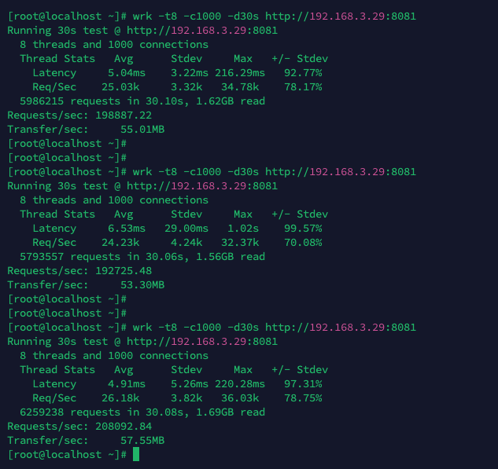
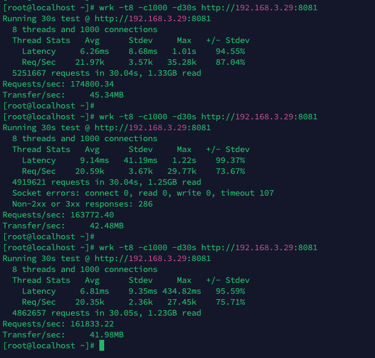
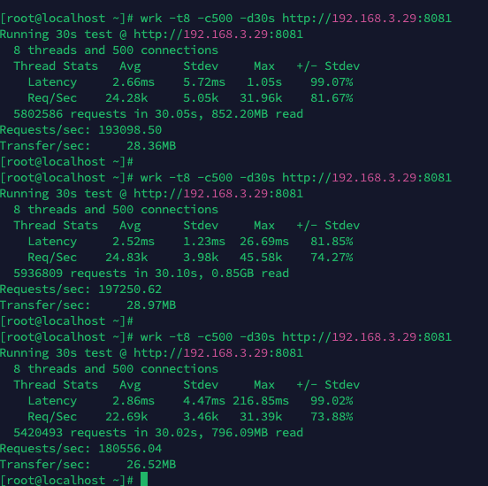
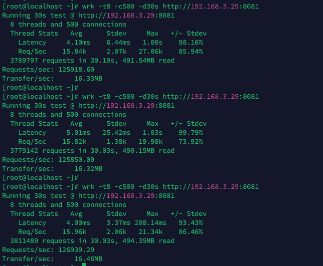
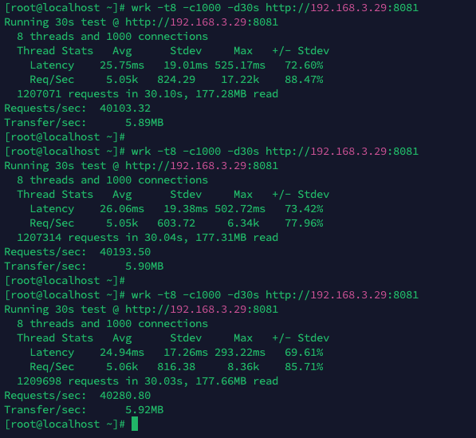

## http压测结果

### 服务器配置
> 代理端, 源站, 压测机均为同样配置: Centos 8C16G

压测机 192.168.3.28
反向代理 192.168.3.29
源站 192.168.3.30

### Fast => Fast

max: 208092

min: 192725

### Fast => Net

max: 174800

min: 161833

### Hertz => Fast

max: 165763

min: 131759

### Hertz => Net

max: 126939

min: 125850

### Net => Fast

max: 40280

min: 40103

### Net => Net

max: 49547

min: 47532
