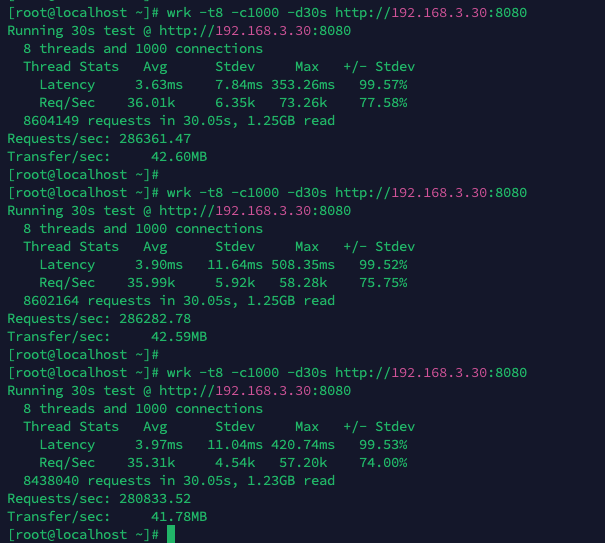

## http压测结果

### 服务器配置

> 服务端, 压测机均为同样配置 Centos 8C16G

压测机 192.168.3.28
反向代理 192.168.3.29
源站 192.168.3.30

### Fast

max: 478870

min: 474082

### Gin

max: 192392

min: 162900

### Hertz

max: 286361

min: 280833

### Iris

max: 209751

min: 187995

### Net

max: 241292

min: 197004